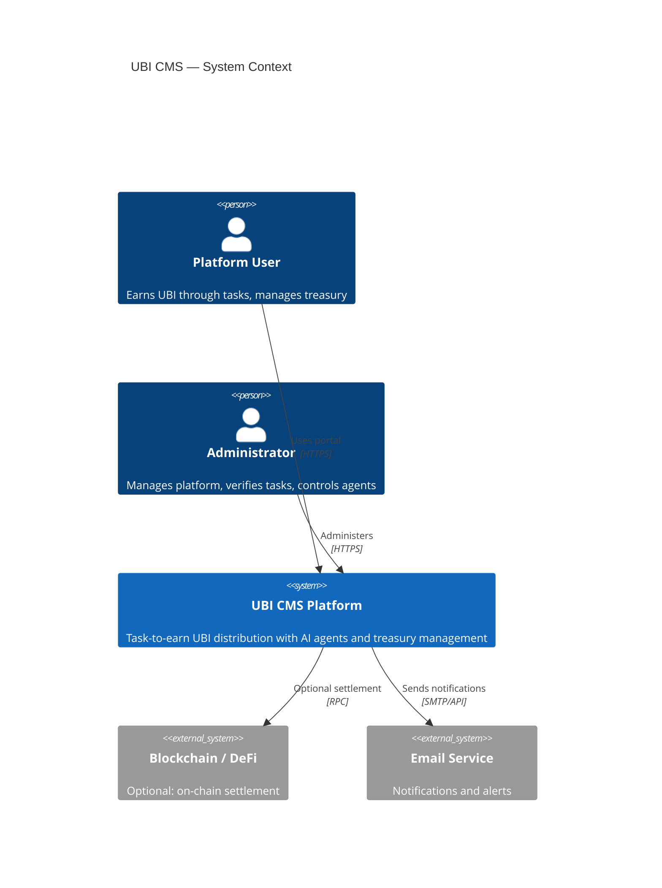
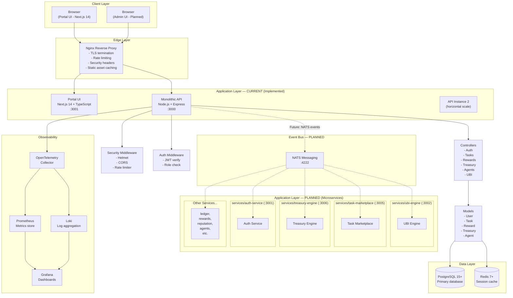
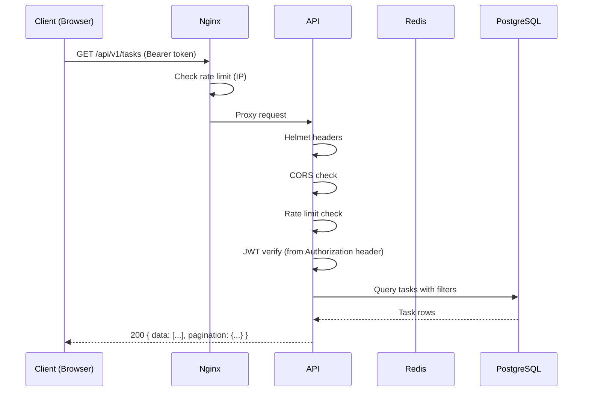
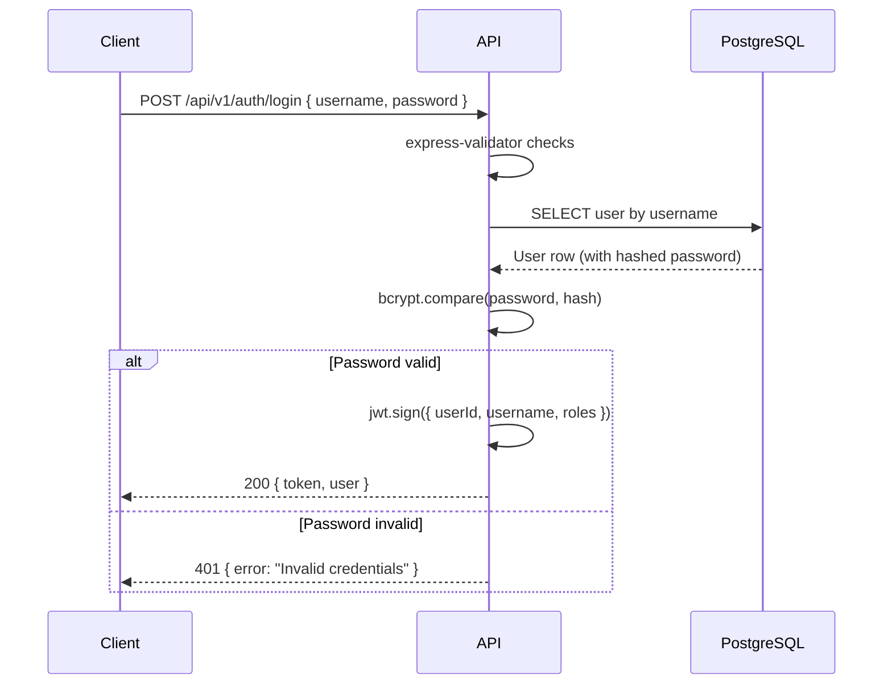
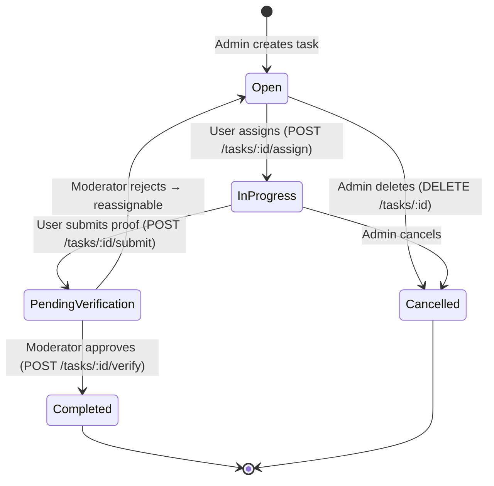
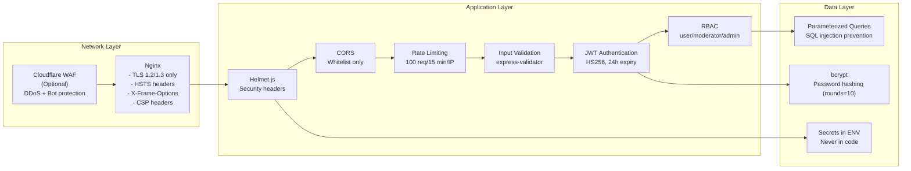
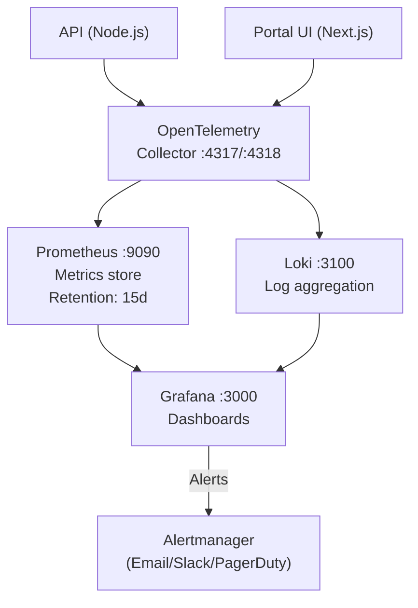

# UBI CMS — System Architecture

> **Document Status**: This document describes the **hybrid architecture** of UBI CMS, combining a **currently implemented monolithic API** with **planned microservices**.

---

## Table of Contents

- [Overview](#overview)
- [System Context](#system-context)
- [Component Architecture](#component-architecture)
- [Current vs Planned Architecture](#current-vs-planned-architecture)
- [Request Flow](#request-flow)
- [Data Flow — UBI Claim](#data-flow--ubi-claim)
- [Data Flow — Task Lifecycle](#data-flow--task-lifecycle)
- [Database Relationships](#database-relationships)
- [Security Architecture](#security-architecture)
- [Observability Stack](#observability-stack)
- [Deployment Topology](#deployment-topology)
- [Scalability Considerations](#scalability-considerations)

---

## Overview

UBI CMS uses a **hybrid architecture**:

| Layer | Status | Description |
|-------|--------|-------------|
| **API (`api/`)** | ✅ **Implemented** | Monolithic Express.js API handling all HTTP requests |
| **Services (`services/`)** | 🚧 **Planned/In Development** | 16 standalone microservices (not yet integrated) |
| **Event Bus (NATS)** | 🚧 **Infrastructure Ready** | Configured in services, not yet used by main API |
| **Portal UI (`frontend/`)** | ✅ **Implemented** | Next.js 14 portal front-end |

The codebase is structured to support **gradual extraction** from monolith to microservices as traffic demands grow.

### Design Principles

1. **Security first** — JWT auth, bcrypt passwords, parameterized queries, Helmet headers, rate limiting by default
2. **Fail fast** — Server refuses to start without required environment variables
3. **Demo-ready** — Client-side fallback mode allows UI exploration without backend
4. **Production-grade** — Multi-stage Docker builds, non-root containers, graceful shutdown, structured logging

---

## System Context



---

## Component Architecture



---

## Current vs Planned Architecture

### Current State (Implemented)

The **monolithic API** at `api/src/index.js` is the **active HTTP interface**:

```
api/src/
├── index.js              # Express app entry point
├── Controllers/          # Route handlers (auth, tasks, rewards, treasury, agents, UBI)
├── Services/            # Business logic (ubiService.js)
├── Models/               # Database models (db.js, User, Task, Reward, etc.)
├── Middleware/           # auth.js, security.js
└── Config/              # app.js (NATS config present but unused)
```

**All requests go through this single Express server** running on port 3000.

### Planned State (Microservices)

The `services/` directory contains **16 standalone microservices**:

| Service | Port | Description | NATS | Temporal |
|---------|------|-------------|------|----------|
| `ubi-engine` | 3002 | UBI distribution engine | ✅ | ✅ |
| `task-marketplace` | 3005 | Task creation and management | ✅ | ❌ |
| `treasury-engine` | 3006 | Multi-vault yield optimization | ✅ | ✅ |
| `auth-service` | 3001 | Authentication (Keycloak) | ❌ | ❌ |
| `ledger-service` | 3001 | Double-entry accounting | ✅ | ❌ |
| `rewards-engine` | - | Reward distribution | ✅ | ✅ |
| `reputation-service` | - | Reputation scoring | ✅ | ❌ |
| `agent-runner` | - | AI agent sandbox execution | ✅ | ✅ |
| `agent-control-plane` | - | Agent orchestration | ✅ | ❌ |
| `notifications-service` | - | Email/push notifications | ✅ | ❌ |
| `referral-service` | - | Referral tracking | ✅ | ❌ |
| `knowledge-service` | - | Vector knowledge base | ✅ | ❌ |
| `governance-service` | - | DAO proposals | ✅ | ✅ |
| `reporting-service` | - | Analytics reporting | ✅ | ❌ |
| `data-vault-service` | - | Data encryption/storage | ✅ | ❌ |
| `business-builder` | - | Business logic builder | ✅ | ❌ |

### Integration Status

| Component | Status | Notes |
|-----------|--------|-------|
| Main API → Services | 🚧 **Not Integrated** | Services run standalone, not called by main API |
| NATS | 🚧 **Infrastructure Ready** | Configured in services, main API has config but no publisher/subscriber |
| Temporal | 🚧 **Infrastructure Ready** | Configured in services, workflows not active |
| Database | ✅ **Shared** | All services use same PostgreSQL instance |

### Migration Path

The planned migration to microservices:

1. **Phase 1**: Extract UBI logic → `services/ubi-engine` (NATS events for `ubi.claimed`, `ubi.distributed`)
2. **Phase 2**: Extract task marketplace → `services/task-marketplace`
3. **Phase 3**: Extract treasury → `services/treasury-engine`
4. **Phase 4**: Extract remaining services
5. **Phase 5**: Main API becomes API gateway only

---

## Request Flow

### Standard Authenticated Request



### Login Flow



---

## Data Flow — UBI Claim

```mermaid
flowchart TD
    A[User clicks Claim UBI] --> B{isDemoUser?}
    B -- Yes --> C[Simulate claim\nUpdate local state\nShow success toast]
    B -- No --> D[POST /api/v1/ubi/claim]
    D --> E{User has unclaimed UBI?}
    E -- No --> F[400 No UBI available]
    E -- Yes --> G[ubiService.claimUbi]
    G --> H[BEGIN TRANSACTION]
    H --> I[Insert into rewards table\ntype='ubi_distribution']
    I --> J[Update user UBI balance]
    J --> K[COMMIT]
    K --> L[200 { amount, message }]
    L --> M[Refresh balance in UI]
```

---

## Data Flow — Task Lifecycle



---

## Database Relationships

```mermaid
erDiagram
    USERS {
        serial id PK
        varchar username UK
        varchar email UK
        varchar password_hash
        varchar[] roles
        varchar status
        timestamp created_at
        timestamp updated_at
    }

    TASKS {
        serial id PK
        varchar title
        text description
        varchar category
        varchar difficulty
        decimal reward_amount
        varchar reward_currency
        integer max_participants
        integer current_participants
        varchar status
        timestamp deadline
        text proof_requirements
        timestamp created_at
    }

    TASK_ASSIGNMENTS {
        serial id PK
        integer task_id FK
        integer user_id FK
        varchar status
        text proof_url
        text feedback
        timestamp submitted_at
        timestamp verified_at
        timestamp created_at
    }

    REWARDS {
        serial id PK
        integer user_id FK
        decimal amount
        varchar currency
        varchar type
        varchar source_type
        integer source_id
        varchar status
        timestamp created_at
        timestamp processed_at
    }

    TREASURY_ACCOUNTS {
        serial id PK
        integer user_id FK UK
        decimal balance
        varchar currency
        timestamp updated_at
    }

    TREASURY_TRANSACTIONS {
        serial id PK
        integer user_id FK
        varchar type
        decimal amount
        varchar currency
        decimal balance_after
        jsonb metadata
        timestamp created_at
    }

    TREASURY_STRATEGIES {
        serial id PK
        varchar name
        varchar protocol
        decimal apy
        varchar risk_level
        decimal allocation
        boolean active
        timestamp created_at
    }

    AGENTS {
        uuid id PK
        integer owner_id FK
        varchar name
        text description
        varchar capability
        varchar endpoint
        varchar auth_type
        varchar pricing_model
        decimal price_per_call
        varchar status
        integer total_calls
        decimal rating
        timestamp created_at
        timestamp updated_at
    }

    AGENT_EXECUTIONS {
        uuid id PK
        uuid agent_id FK
        integer user_id FK
        jsonb input_data
        jsonb output_data
        varchar status
        integer duration_ms
        decimal cost
        timestamp completed_at
        timestamp created_at
    }

    USERS ||--o{ TASK_ASSIGNMENTS : "completes"
    TASKS ||--o{ TASK_ASSIGNMENTS : "has"
    USERS ||--o{ REWARDS : "earns"
    USERS ||--|| TREASURY_ACCOUNTS : "owns"
    USERS ||--o{ TREASURY_TRANSACTIONS : "makes"
    USERS ||--o{ AGENTS : "owns"
    USERS ||--o{ AGENT_EXECUTIONS : "runs"
    AGENTS ||--o{ AGENT_EXECUTIONS : "produces"
```

---

## Security Architecture



### Security Controls Summary

| Control | Implementation | Details |
|---------|---------------|---------|
| Transport Security | Nginx + TLS | TLS 1.2/1.3, HSTS, certificate management |
| Authentication | JWT / HS256 | 24h expiry, required `JWT_SECRET` env var |
| Password Security | bcrypt | 10 rounds minimum |
| Authorization | RBAC | 3 tiers: user, moderator, admin |
| Input Validation | express-validator | Per-route field validation |
| SQL Injection | Parameterized queries | All database calls use `$n` placeholders |
| XSS Prevention | Helmet CSP | Content-Security-Policy headers |
| Rate Limiting | express-rate-limit | 100 req/15 min per IP |
| Secrets Management | Environment variables | Fail-fast on missing required env vars in production |
| CORS | Whitelist | Only configured origins accepted |

---

## Observability Stack



### Key Metrics Tracked

| Metric | Type | Description |
|--------|------|-------------|
| `http_request_duration_seconds` | Histogram | Request latency per endpoint |
| `http_requests_total` | Counter | Total requests by method, path, status |
| `ubi_claims_total` | Counter | UBI claims processed |
| `tasks_completed_total` | Counter | Tasks verified and rewarded |
| `treasury_deposits_total` | Counter | Treasury deposit transactions |
| `active_users_gauge` | Gauge | Currently active users |

---

## Deployment Topology

### Production (Docker Compose)

```
                    ┌─────────────────────────────────────────┐
                    │             Host Machine                 │
                    │                                          │
         :443 ──────┤──► Nginx                                │
         :80  ──────┤     │                                    │
                    │     ├──► Portal UI (:3001)               │
                    │     └──► API (:3000) ×2 replicas         │
                    │                │                         │
                    │     ┌──────────┼──────────┐             │
                    │     ▼          ▼           ▼             │
                    │  PostgreSQL  Redis   Prometheus/Grafana  │
                    │  (:5432)    (:6379)     (:9090/:3000)    │
                    └─────────────────────────────────────────┘
```

### Container Summary

| Service | Image | Internal Port | Replicas | Health Check |
|---------|-------|---------------|----------|-------------|
| `nginx` | nginx:alpine | 80, 443 | 1 | TCP check |
| `api` | `ubi-api:latest` | 3000 | 2 | GET /health |
| `portal-ui` | `ubi-portal-ui:latest` | 3001 | 1 | GET /api/health |
| `postgres` | postgres:15 | 5432 | 1 | pg_isready |
| `redis` | redis:7-alpine | 6379 | 1 | redis-cli ping |
| `prometheus` | prom/prometheus:3.x | 9090 | 1 | HTTP check |
| `grafana` | grafana:12.x | 3000 | 1 | HTTP check |

---

## Scalability Considerations

### Current Constraints

| Component | Current Limit | Scaling Path |
|-----------|-------------|-------------|
| API | 2 replicas (configurable) | Horizontal: add more replicas behind Nginx |
| Database | Single primary | Vertical first; then read replicas for reporting |
| Redis | Single instance | Redis Cluster or Redis Sentinel for HA |
| File Storage | Not applicable | Add MinIO or S3 for file-based task proofs |
| Microservices | Standalone (not integrated) | Gradual integration via NATS events |

### Recommended Growth Milestones

**0 → 1,000 users:** Current monolithic architecture handles comfortably with 2 API replicas.

**1,000 → 10,000 users:**
- Add PostgreSQL read replica for reporting queries
- Enable Redis auth and connection pooling (pgBouncer)
- Move observability stack to dedicated host

**10,000+ users:**
- Extract UBI engine to `services/ubi-engine` with NATS event-driven architecture
- Extract task marketplace to `services/task-marketplace`
- Introduce Temporal for complex workflow orchestration
- Add CDN for Portal UI static assets

### Microservices Readiness

The codebase is **microservices-ready**:

| Infrastructure | Status | Location |
|----------------|--------|----------|
| NATS Server | Configured | `services/*/src/config/` |
| Temporal | Configured | `services/*/src/config/` |
| Service Discovery | Manual | Service READMEs document ports |
| Health Checks | Implemented | `/health` endpoints in all services |
| Docker Support | Ready | Each service has `Dockerfile` |
