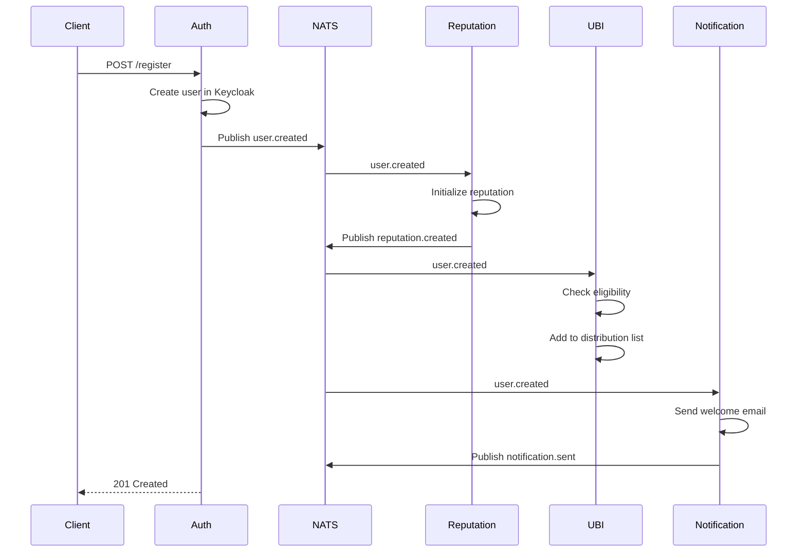
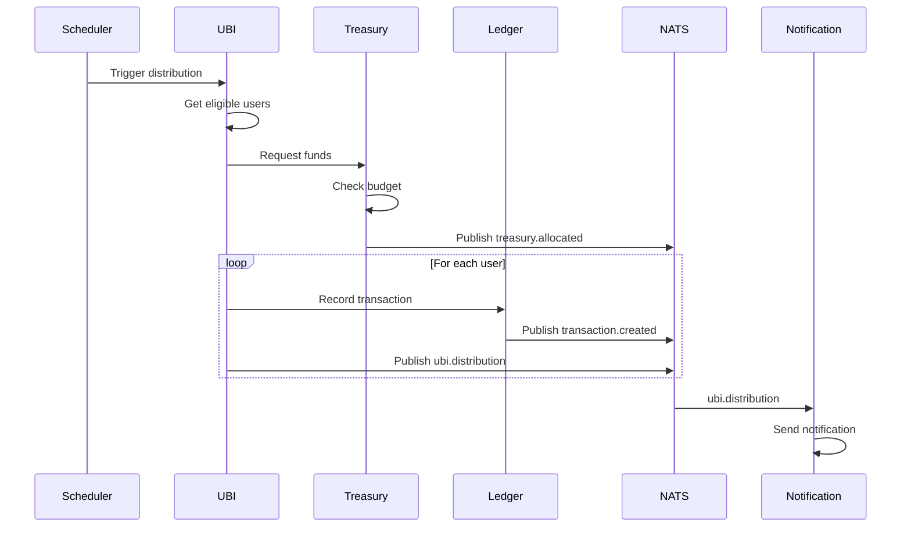
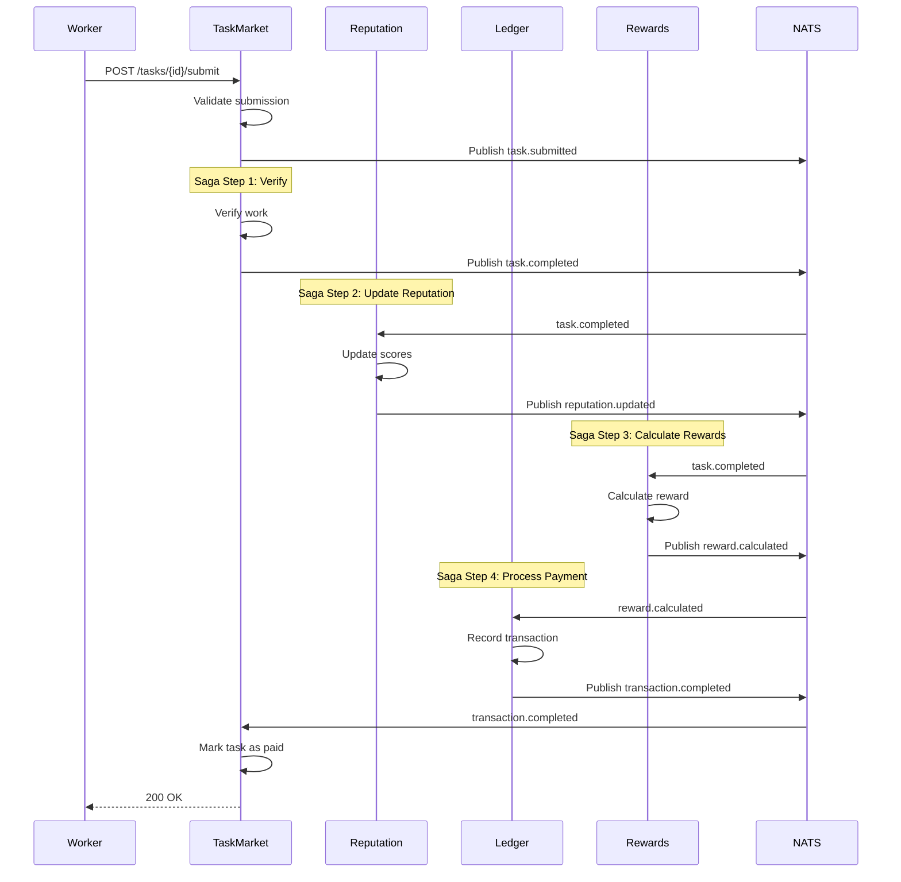
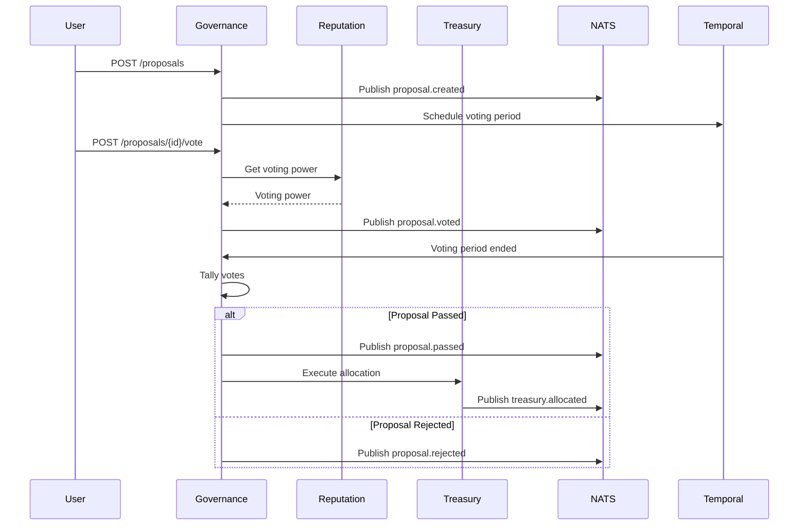
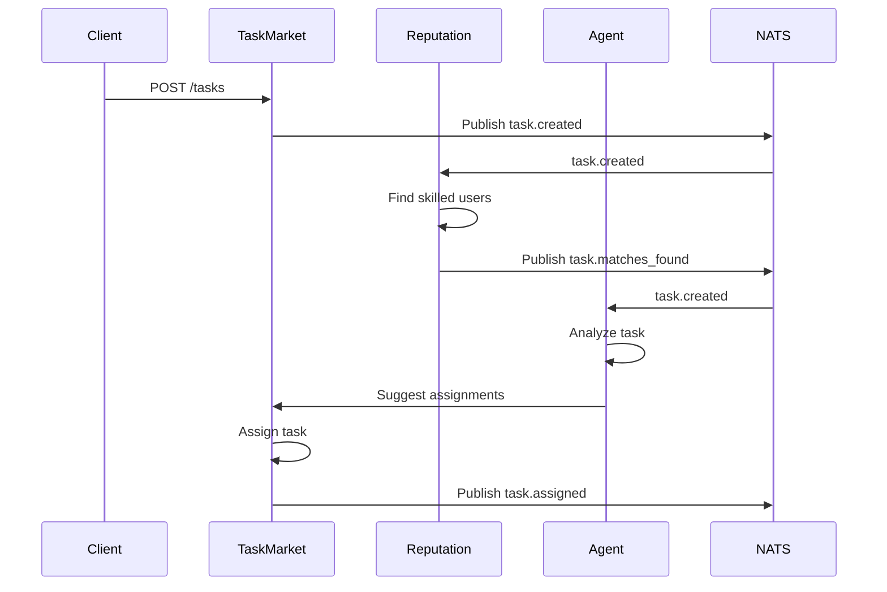

# Event Choreography and Flows

This document describes all event flows in the UBI-CMS platform, including event schemas, handlers, and sequencing.

## Event Naming Convention

Events follow the pattern: `{domain}.{action}`

Examples:
- `user.created`
- `proposal.voted`
- `task.completed`

## Event Structure

All events extend the base event structure:

```typescript
interface BaseEvent {
  eventId: string;          // UUID
  eventType: string;        // Event type (e.g., "user.created")
  timestamp: string;        // ISO 8601 timestamp
  correlationId: string;    // UUID for tracking related events
  causationId: string;      // UUID of the causing event
  tenantId?: string;        // Multi-tenant isolation
  userId?: string;          // User who triggered the event
  metadata?: Record<string, any>;
  data: any;                // Event-specific payload
}
```

---

## Core Event Flows

### 1. User Registration Flow



**Event: `user.created`**
```typescript
{
  eventType: "user.created",
  data: {
    userId: "uuid",
    email: "user@example.com",
    username: "username",
    roles: ["member"]
  }
}
```

**Subscribers:**
- Reputation Service → Initialize reputation score
- UBI Engine → Check eligibility, add to distribution
- Notification Service → Send welcome email
- Referral Service → Check for referral code

---

### 2. UBI Distribution Flow



**Event: `ubi.distribution`**
```typescript
{
  eventType: "ubi.distribution",
  data: {
    distributionId: "uuid",
    amount: 1000,
    currency: "CREDITS",
    recipientCount: 500
  }
}
```

**Subscribers:**
- Ledger Service → Record transactions
- Treasury Engine → Update budgets
- Notification Service → Notify recipients
- Reporting Service → Update analytics

---

### 3. Task Completion Flow (Saga Pattern)



**Compensation Flow** (if any step fails):
```
1. If Ledger fails → Rewards compensates (reverse calculation)
2. If Rewards fails → Reputation compensates (revert score)
3. If Reputation fails → TaskMarket compensates (revert completion)
```

---

### 4. Proposal Voting Flow



**Event: `proposal.voted`**
```typescript
{
  eventType: "proposal.voted",
  data: {
    proposalId: "uuid",
    voterId: "uuid",
    vote: "yes" | "no" | "abstain",
    votingPower: 100
  }
}
```

---

### 5. Task Creation and Assignment Flow



---

## Event Correlation

### Correlation ID Flow

All related events share the same `correlationId`:

```
User Registration (correlationId: abc-123)
├─ user.created
├─ reputation.created
├─ ubi.eligibility_checked
└─ notification.sent (welcome email)
```

### Causation Chain

Events track their cause through `causationId`:

```
task.created (eventId: evt-001)
  └─ task.assigned (causationId: evt-001, eventId: evt-002)
      └─ task.completed (causationId: evt-002, eventId: evt-003)
          └─ reputation.updated (causationId: evt-003, eventId: evt-004)
          └─ reward.distributed (causationId: evt-003, eventId: evt-005)
```

---

## Event Retention Policies

### EVENTS Stream (7-day retention)
- All domain events
- Used for event sourcing
- Audit trail

### COMMANDS Stream (1-day retention)
- Command messages
- Short-lived requests
- Quick processing

---

## Dead Letter Queue (DLQ)

Failed events after max retries are sent to DLQ:

**Subject**: `dlq.{original_subject}`

**Example**: `dlq.events.user_created`

**Monitoring**: Alert on DLQ messages

---

## Event Replay

Services can replay events for:
- Recovery after downtime
- Rebuilding projections
- Debugging

**API**: 
```bash
# Replay events from specific time
curl -X POST /api/events/replay \
  -d '{"from": "2024-01-01T00:00:00Z", "subject": "events.user_created"}'
```

---

## Event Schema Registry

All event schemas are defined in: `/shared/src/types/index.ts`

**Versioning**: Events include schema version in metadata

```typescript
{
  eventType: "user.created.v2",  // Version in event type
  metadata: {
    schemaVersion: "2.0"
  }
}
```

---

## Idempotency

All event handlers must be idempotent. Use `eventId` for deduplication:

```typescript
// Example: Check if event already processed
const processed = await redis.get(`processed:${event.eventId}`);
if (processed) {
  logger.info('Event already processed', { eventId: event.eventId });
  return;
}

// Process event
await handleEvent(event);

// Mark as processed
await redis.setex(`processed:${event.eventId}`, 86400, 'true');
```

---

## Error Handling Strategy

1. **Transient Errors**: Retry with exponential backoff
2. **Permanent Errors**: Send to DLQ, alert team
3. **Partial Failures**: Use saga compensation

**Retry Policy**:
- Max retries: 3
- Initial delay: 1s
- Max delay: 30s
- Backoff multiplier: 2

---

## Event Monitoring

### Metrics
- Event publish rate
- Event processing latency
- Event failures
- DLQ size

### Alerts
- DLQ messages > 100
- Processing latency > 5s
- Event failure rate > 5%
- Missing expected events

---

## Testing Events

### Unit Tests
```typescript
it('should publish user.created event', async () => {
  const event = await natsClient.publish('user.created', userData);
  expect(event.eventType).toBe('user.created');
  expect(event.data.userId).toBeDefined();
});
```

### Integration Tests
```typescript
it('should handle user registration flow', async () => {
  // Publish user.created
  await natsClient.publish('user.created', userData);
  
  // Wait for async processing
  await sleep(1000);
  
  // Verify reputation created
  const reputation = await reputationService.getByUserId(userId);
  expect(reputation).toBeDefined();
  
  // Verify UBI eligibility checked
  const eligible = await ubiEngine.checkEligibility(userId);
  expect(eligible).toBe(true);
});
```

---

## Best Practices

1. **Event Size**: Keep events < 64KB
2. **Event Granularity**: One event per business action
3. **Event Naming**: Use past tense (e.g., `created`, not `create`)
4. **Event Data**: Include only necessary data, reference IDs for large objects
5. **Event Ordering**: Don't assume order unless using ordered consumers
6. **Event Versioning**: Plan for schema evolution
7. **Event Security**: Don't include sensitive data in events
8. **Event Monitoring**: Track all published and consumed events

---

## Event Catalog

| Event Type | Publisher | Subscribers | Purpose |
|------------|-----------|-------------|---------|
| `user.created` | Auth Service | Reputation, UBI, Notification, Referral | New user registered |
| `user.updated` | Auth Service | All interested services | User profile updated |
| `proposal.created` | Governance | Notification | New proposal submitted |
| `proposal.voted` | Governance | Governance (tally) | Vote cast on proposal |
| `task.created` | Task Marketplace | Reputation, Agent, Notification | New task available |
| `task.completed` | Task Marketplace | Reputation, Rewards, Ledger | Task finished |
| `ubi.distribution` | UBI Engine | Ledger, Notification, Reporting | UBI distributed |
| `transaction.created` | Ledger | Reporting | Transaction recorded |
| `reputation.updated` | Reputation | Task Marketplace, Governance | Reputation changed |
| `reward.distributed` | Rewards Engine | Ledger, Notification | Reward given |

---

## Event Flow Diagrams

See `/docs/diagrams/event-flows/` for detailed sequence diagrams for each flow.
